# AudioMalfunctionDetection
Project for detecting machine malfunction from audio files.


### Exploring the Data

The data comprises of 10 second sound samples that recorded normal or abnormal features of 
machines during production. There are four types of machines : valves, pumps, fans and slide rails.
Each machine has samples of 4 different models of the same type.

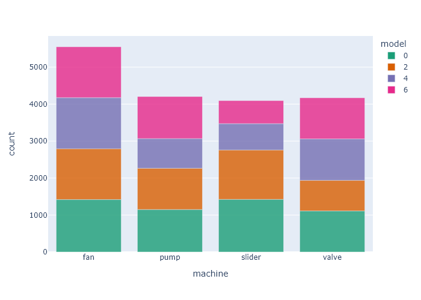

The normal to abnormal ration per machine type looks like this:


### Channel optimization

The device the client will be using for the signal detection are the TAMAGO-03 microphones from
*System In Frontier Inc.*, which uses an array of 8 microphones to detect sounds from all angels.

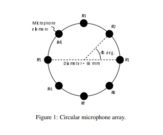

 Each microphone is directed towards a machine, and picks that signale up louder that the others,
 represented here.
 
 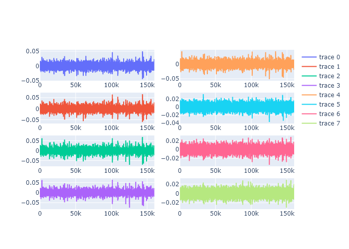
 
 When the accuracy is plotted against each channel it gives us these results.

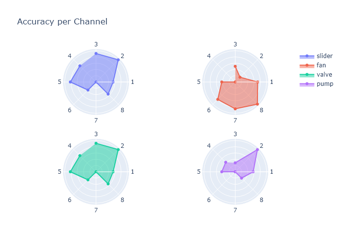

Our ideal pipeline would be to split the channel, and use the optimal channel for each machine.
For each machine a seperate detection is made optimizing the results.

### PreProcessing

Each signal is converted into unique mel spectrograms that look like these:

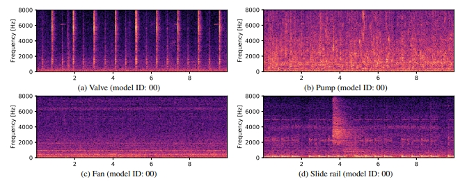

The precise parameters of this generation are optimized for each machine_type,
using a train and validation dataset split.

### Model Types

For each machine type there are several different models, the accuracy per model deviates and is not
the same shown in the following graph:

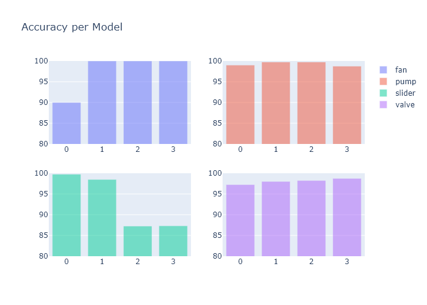

From this we can conclude that for some models we can predict failure close to perfectly and for some others
the prediction is less otimal.

### Valves

Due to their placement in the factory the valves are of significant importance. Any failure of a valve
can cause malfunction in the pumps, which are far harder to repair or replace. As such we placed
special importance on detecting failure in them.

In contrast to pump, fan and slide rails that have a continouous sound recording the valves open and
close at different intervals.

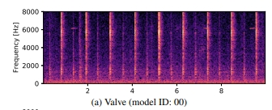

We noticed that a portion of the malfunctions happen because of irregularities in the time intervals between these operations. 

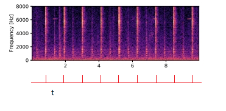

Calculating the average of these time intervals per sound sample gave a realistic range of normal functioning.

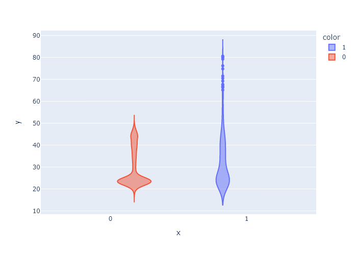

applying a threshold over the averages automatically cuts the top of the abnormale group on th right.
This is a group of about 9% of all valve malfunctions that are detected with 100% precision almost immediately.

After this normal detections are used to complement accuracy of the other malfunctions.

### Models


Two types of models have been trained for the detection, KNN algorithms and One-class SVMs. 

#### KNN

The KNN model has been cross-validated to avoid overfitting.
Details of the performance of KNN:

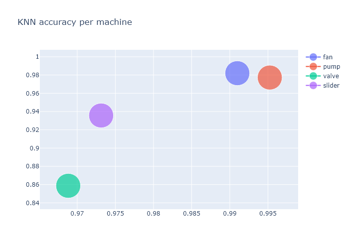

#### One-class SVM
The algorithm one-class SVM aims to model a large number of "normal" samples, then distinguish "abnormal" samples
as those that deviate from the model, i.e. get a low score. We trained the classifier by adjusting the hyperparameters 
that give the best classification for the validation set.
Considering the nature of the problem, precision and recall are the best metrics to evaluate performance. In our problem,
high precision means most of the samples that are labeled as abnormal are in fact abnormal. High precision ensures that 
when workers are prompted to check a machine by the automatized system, they find a machine that is in fact abnormally 
operating. This decreases maintenance costs. 
On the other hand, high recall means most of the samples from machines that are operating abnormally 
are cought by the automatized system and labeled as such. High recall ensures that abnormally operating machines 
are detected in time. Then they can can go under the maintenance process and a failure is prevented.

Precision and recall provided by our model can be chosen from a set of values. 
The precision-recall curve for the one-class SVM model is plotted below, with different hyperparameters. 
It has been trained on half the dataset and tested on the other half.

We are able to adjust our model according to your priorities regarding precision and recall.
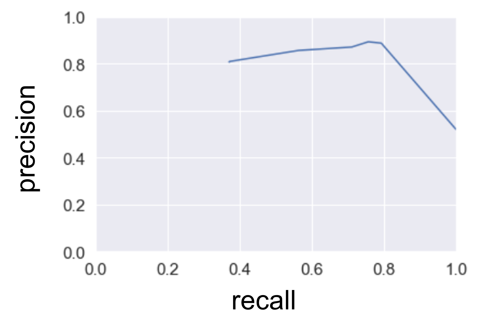

We would like to work on numerically expressing the cost of a failed maintenance or a false maintenance alarm. We
can do this with numerical data from you. With this, we can choose the model parameters that minimize the total cost.

### Clustering
We aim to discover if the data you provided could be automatically labeled. This would allow saving substantial 
time for further data you collect from the factory floor. We focused on labeling machine models, and anomalies.

We clustered audio recordings from fans, and realized the automatically formed clusters correspond 
strongly to fan models. Below is a graph with 4 clusters. In the top graph, colors represent clusters, in the bottom 
graph, colors represent fan models. 

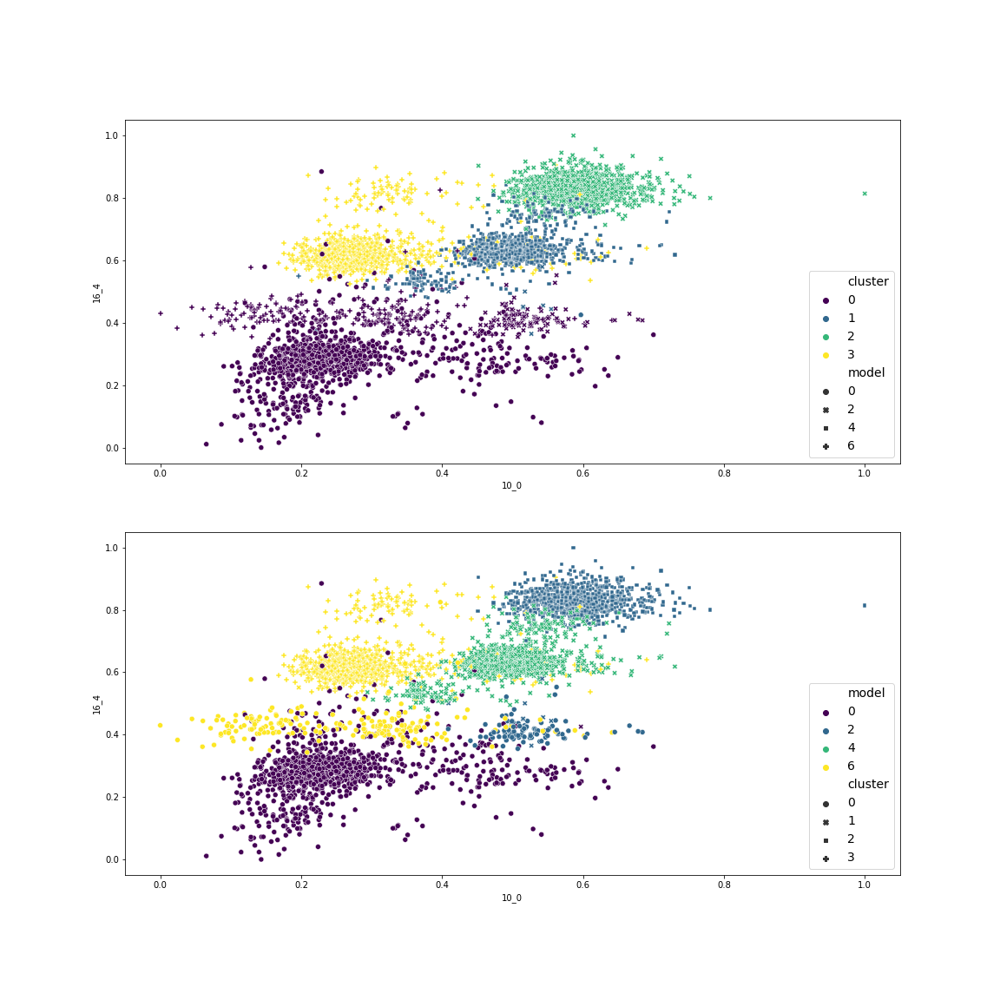

Below are the number of samples from each model (rows) in each cluser (columns):


## Installation
Download the repository from GitHub using:
```python
git@github.com:eceboran/AudioMalfunctionDetection.git
```

The packages required to run the project can be found in:
```python
requirements.txt
```
To install all required packages, follow these steps:
- Crete and activate your virtual environment. 
- Navigate to the main project repository that contains requirements.txt.
- To install the required packages in pip, in the terminal, run:
```python
python3 -m pip install -r requirements.txt
```
- To install them with anaconda, run:
```python
conda install --file requirements.txt 


This project used librosa <a href="https://doi.org/10.5281/zenodo.591533" rel=nofollow>
<p>McFee, Brian, Colin Raffel, Dawen Liang, Daniel PW Ellis, Matt McVicar, Eric Battenberg, and Oriol Nieto. "librosa: Audio and music signal analysis in python." In Proceedings of the 14th python in science conference, pp. 18-25. 2015.</p>
